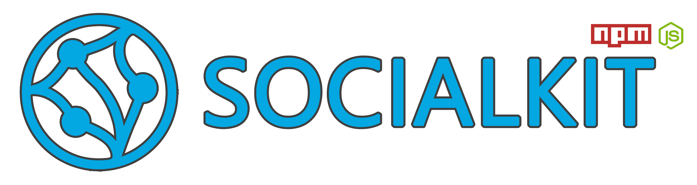

# SocialKit - One API to rule them all your social media!

Social kit is a unified API infrastructure for social media built with **nodejs**. Also its a **npm package**.
<br>
<br>

## Available Social Media Clients

1. **[Bluesky](#1-bluesky)**: https://bsky.app/ *(made with @atproto/api)*

## 1. Bluesky

### Creating the client

First you need to call the client with your account details. Then you need to login.

```js
  import socialkit from 'socialkit'

  const bskyClient = new socialkit.BskyClient('username.bsky.social', 'your-password')
  await bskyClient.login()
```

The client constructor has 3 params:
1. The username
2. The password
3. Debug mode (default: false): It's a switch to open debug console logs.

```js
  new socialkit.BskyClient(username, password, debug = false)
```

After this the client is ready to use.

### Client Methods

1. **Login**: Necessary to login after implementing the object.
```js
  await bskyClient.login()
```

2. **getTimeline (type = null, limit = 10, includeSelf = true)**: Get the feed posts.
```js
  // Available types: post, repost, reply, quote
  const timeline = await bskyClient.getTimeline('post', 50, false)
```

3. **getProfilePosts (handle, type = 'post', limit = 10)**: Get the profile posts.
```js
  // if the handle is undefined, it gets self posts.
  const posts = await bskyClient.getProfilePosts(undefined, 'post', 10)
```

4. **replyToPost (text, parentUri)**: Send reply to a post.
```js
  // You can get the uri from feed or profile posts.
  await bskyClient.replyToPost('Hi!', 'at://did:plc:*****/app.bsky.feed.post/******')
```


<br>
<br>

## Important Note
Use at your own discretion. Do not spam people with this. We discourage any stalkerware, bulk or automated messaging usage.

## Contact
For any questions or feedback about the project, please contact us through GitHub or emir@akatron.net

## Contributions
If you would like to contribute, please feel free to submit a pull request. We welcome any contributions!

## License
This project is licensed under the GNU General Public License v3.0. See the `LICENSE` file for more information.
